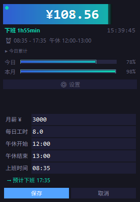

# Salary Ticker

实时工资进度桌面小工具，输入月薪和弹性工作时间后，实时显示工资累计进度。

## 功能

- **迷你悬浮窗** — 置顶显示实时工资金额，进度条作为背景
- **单击切换** — 日累计 / 月累计金额，进度条同步变化
- **双击展开** — 详情视图：时钟、午休/下班倒计时、日/月进度条、设置按钮
- **右键退出** — 右键菜单可退出程序
- **粒子特效** — 工资跳动时金色粒子飘散，跨越千位时粒子爆发
- **进度条发光** — 渐变填充 + 脉冲呼吸 + 前沿柔光
- **午休暂停** — 设置午休时间段，期间暂停计薪并显示倒计时
- **自动打卡** — 每天首次启动自动记录上班时间
- **自动计算下班时间** — 上班时间 + 每日工时 + 午休时长

## 截图

迷你模式：


详情模式：



## 使用

### 直接运行（需 Python + tkinter）

```bash
python salary_ticker.py
```

### 打包为 exe

```bash
pip install pyinstaller
pyinstaller --onefile --windowed --name "SalaryTicker" salary_ticker.py
```

生成的 exe 在 `dist/SalaryTicker.exe`，可直接分发运行，无需安装 Python。

## 设置项

| 设置 | 说明 | 默认值 |
|------|------|--------|
| 月薪 ¥ | 税前月薪 | 0 |
| 每日工时 | 每天工作小时数 | 8 |
| 午休开始 | 午休起始时间 | 12:00 |
| 午休结束 | 午休结束时间 | 13:00 |
| 上班时间 | 每天首次启动自动记录 | 09:00 |

设置保存在 `%APPDATA%\salary-ticker\settings.json`。

## 技术栈

- Python 3 + tkinter
- PyInstaller（打包）
